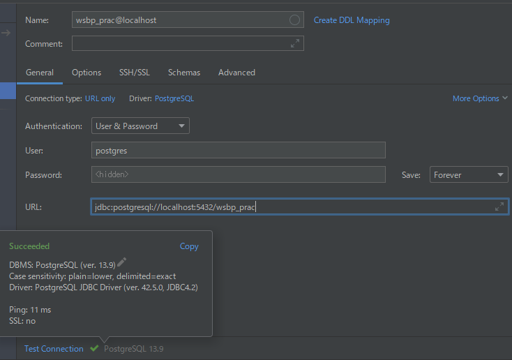
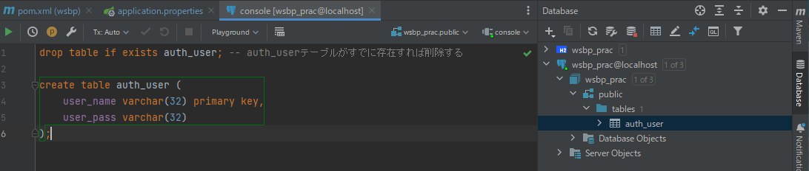

## DBをH2からPostgreSQLに変更する

### このプロジェクトで使用する(postgresの)データベースを作成する
コマンドプロンプト（ターミナル）にて次のコマンドを打つ  
※パスワードの入力を求められます  
`createdb -U postgres wsbp_prac`  

（Macでbrewの人はpostgresユーザがいないかも、初期ユーザはMac自体のログインユーザになっている）  
`createuser -s -P postgres` -> パスワードにも`postgres`を設定する  
postgresユーザができたら、createdbできるはずです。

### IntelliJへの設定
1. IntelliJの左側のメニューから データベース タブを開く
2. 表示されるメニューの中から「＋」ボタンを押し、 データソース ＞ PostgreSQL を選ぶ
3. 不足しているドライバーファイルをダウンロードしてください でダウンロードを押す
4. 接続タイプ は `URL only`
5. 認証は `ユーザーとパスワード`
6. ユーザーは `postgres`
7. パスワードは `postgres`
8. URLは `jdbc:postgresql://localhost:5432/wsbp_prac`
10. 接続のテスト を押して成功することを確認する
11. OK を押してダイアログを閉じる



### テーブルを作成する  
**Postgresのクエリコンソールを開き、** [H2でのテーブル作成](https://github.com/gishi-yama/wicket_spring-boot_practice/blob/master/doc/C02/01.md#%E3%83%86%E3%83%BC%E3%83%96%E3%83%AB%E3%81%AE%E4%BD%9C%E6%88%90)と同様のテーブルを作成する。  



※現在のデータベースに対するイントロスペクションが実施されていません。 と表示された場合は、データベースのイントロスペクションを実行してください。

### アプリケーションへの設定

pom.xmlの以下の部分を変更する
``` xml
<dependency>
  <groupId>com.h2database</groupId>
  <artifactId>h2</artifactId>
  <scope>runtime</scope>
</dependency>
```
↓
``` xml
<dependency>
  <groupId>org.postgresql</groupId>
  <artifactId>postgresql</artifactId>
  <scope>runtime</scope>
</dependency>
```

application.propertiesの以下の部分を変更する
``` properties
spring.datasource.driver-class-name=org.h2.Driver
spring.datasource.url=jdbc:h2:~/h2db/wsbp_prac;Mode=PostgreSQL;AUTO_SERVER=TRUE;
spring.datasource.username=bxxxxxxx
spring.datasource.password=bxxxxxxx
```
↓
``` properties
spring.datasource.driver-class-name=org.postgresql.Driver
spring.datasource.url=jdbc:postgresql://localhost:5432/wsbp_prac
spring.datasource.username=postgres
spring.datasource.password=postgres
```

### 最後に
アプリケーションを起動して、実際にユーザ登録ができれば成功です。  
postgresは通常、スーパーユーザなので、アプリケーション用のユーザを作成するのが真っ当です。  
今回は省略しました。
